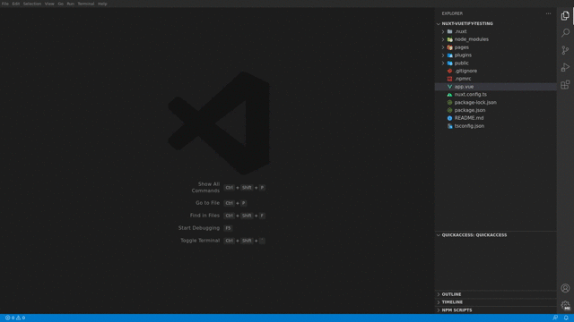

# QuickAccess extention

This extension allows you to store files in a visual clipboard, making it easy to access them quickly and efficiently.

## Features

## Requirements

> None

## Extension Settings

<!-- Include if your extension adds any VS Code settings through the `contributes.configuration` extension point. -->

<!-- This extension contributes the following settings:

* `myExtension.enable`: Enable/disable this extension.
* `myExtension.thing`: Set to `blah` to do something. -->

> None

## Known Issues

> None

## Release Notes

### 0.0.1

🚀 Initial release

**Enjoy!**
